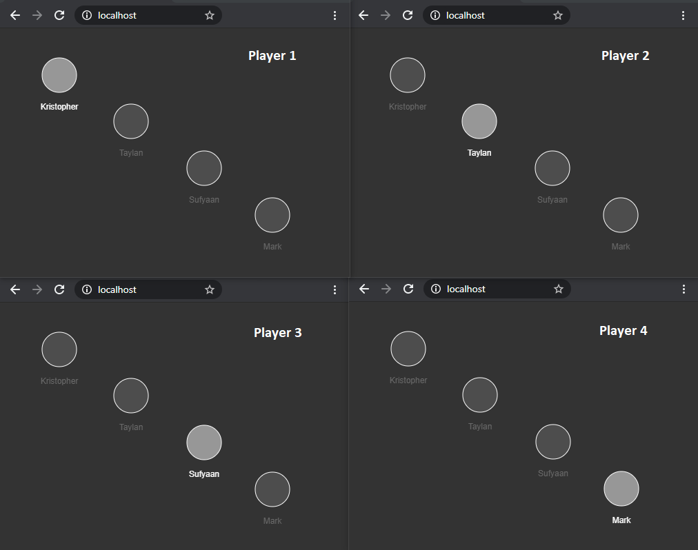

# MMO Game Javascript
A JavaScript basic implementation of a Massive Multiplay Online Game to run on browser with Node.js and P5.js.

The project has a application service to run static files running on port 80 and a socket service to make the multiplay game work, it is running on port 3000.

The game is very basic, it allows just to click on screen to move your player, and see another players moving around of the screen, you are the white circle and another players are the gray circles.



### Instalation
```
npm i
```

### Run
```
npm run start
```

### Dependencies
* Node.js
* express
* Socket.io
* P5.js
